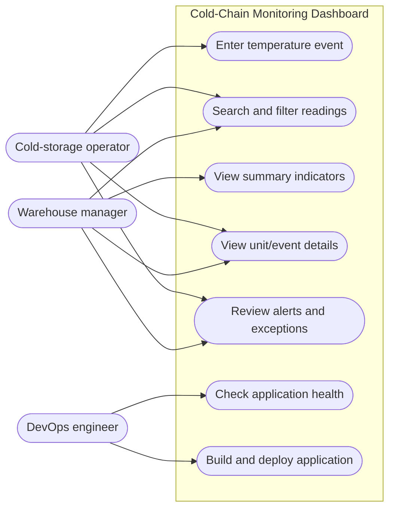

# Task 3 — Use-case diagram

```mermaid
flowchart LR
    Operator([Cold-storage operator])
    Manager([Warehouse manager])
    DevOps([DevOps engineer])

    subgraph App[Cold-Chain Monitoring Dashboard]
      Add([Enter temperature event])
      Search([Search and filter readings])
      Summary([View summary indicators])
      Details([View unit/event details])
      Alerts([Review alerts and exceptions])
      Health([Check application health])
      Deploy([Build and deploy application])
    end

    Operator --> Add
    Operator --> Search
    Operator --> Details
    Operator --> Alerts
    Manager --> Summary
    Manager --> Search
    Manager --> Details
    Manager --> Alerts
    DevOps --> Health
    DevOps --> Deploy
```
